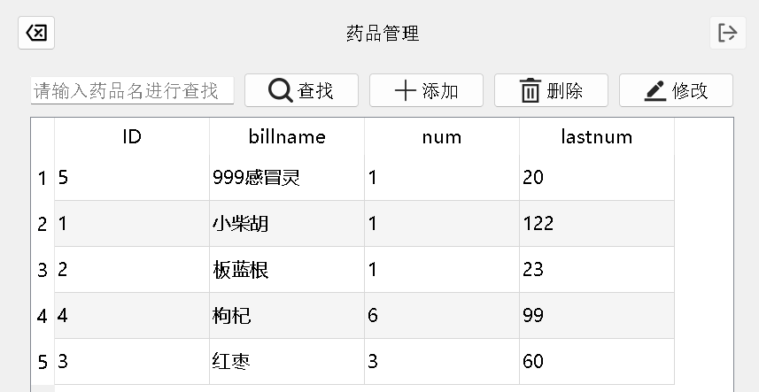
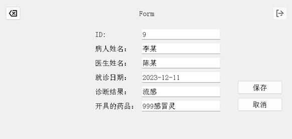

#### 社区医疗信息管理系统

这是一个使用Qt语言开发的社区医疗信息管理系统，同级目录下Lab4a.db文件为系统打包成可执行文件的数据库。Runnable File文件下的clickme.exe即可双击运行。源代码在SourceCode文件夹中。

#### 可执行文件的登录密码：

管理员登录用户名：admin

密码：123456

医生登录用户名：doctor

密码：123456

##### 主要功能：

*管理员登录功能：设计一个登录界面，管理员可以输入用户名和密码进行登录。程序应实现对登录信息的验证，通过验证后跳转到欢迎界面。

*医生登录功能：在登录界面，医生可以输入用户名和密码进行登录。程序应实现对医生登录信息的验证，并根据医生的身份权限，提供相应的功能。在本项目中，未对医生开放医生管理功能。

*医生管理功能：医生信息包括姓名、性别、年龄、执业证书号等。在医生管理界面，有一个tableView用于显示已录入数据库的医生信息列表，并支持对医生信息进行添加、查询、编辑和排序。

*病人管理功能：病人信息包括姓名、性别、年龄、联系方式等。支持对病人信息进行添加、查询、编辑和排序。

*药品管理功能：设计一个界面，用于管理药品的信息。支持对药品信息进行添加、查询、编辑和排序。

*就诊记录功能：实现对就诊记录的录入、修改和删除操作。支持对就诊记录信息进行添加、查询、编辑和排序。

##### 使用环境和技术说明：

开发环境：Windows 11、Git、Qt Creator、Qt语言。  

技术说明： Qt Widgets  、Qt SQL等

#### 流程图如下：

#### 运行界面演示：

欢迎大家提交Issue、Fork！

